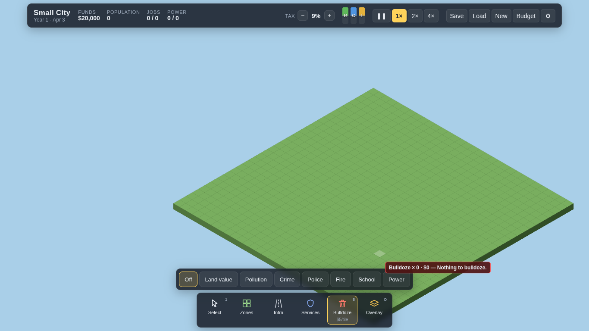
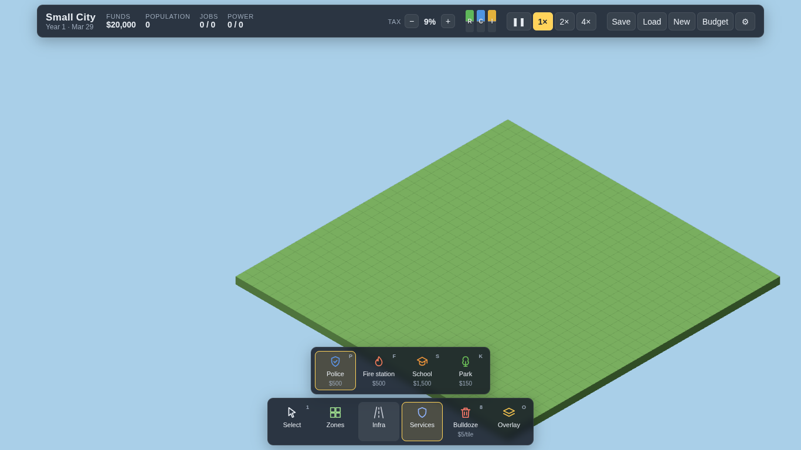
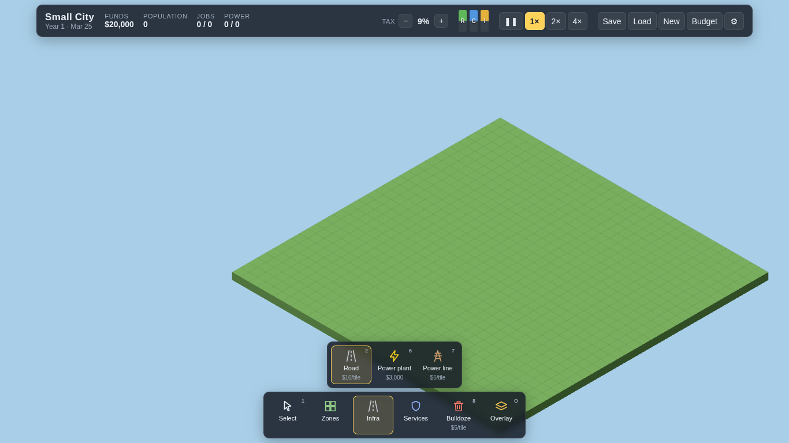
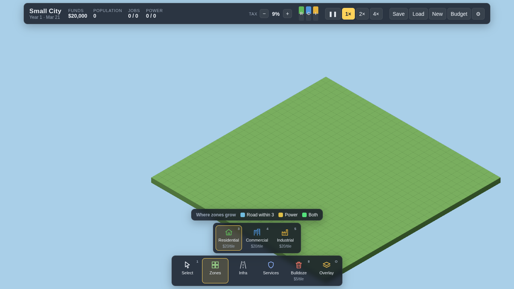

# Small City

A browser city-builder written from scratch in TypeScript and three.js. Zone land, lay roads, bring power, and watch your city grow.

**▶ Play it:** https://elfarisssaid19.github.io/small-city/



<p align="center">
  
  
  
</p>

## Features

- 32×32 map with an isometric camera: pan, zoom and rotate in 90° steps
- Residential, commercial and industrial zones that grow on their own: empty lot → construction → levels 1–3, and get abandoned when neglected
- Roads that auto-connect (straight, corner, T, cross, dead end)
- Power plants and power lines, with capacity limits and lines crossing roads
- Citizens, jobs within a commute radius, and RCI demand driving growth
- Real economy: build costs, monthly taxes with an adjustable rate, upkeep and debt
- Clear feedback: missing-requirement icons on zones, a requirement checklist, and road/power overlays while zoning
- In-game dialogs and toast notifications
- Autosave and manual save/load in the browser, with a versioned save format
- Low-poly 3D models with shadows, plus a low-quality mode for weak phones
- Mouse, touch and keyboard controls

## How to play

Zones don't build themselves right away. A zone grows only when it has:

1. **A road** within 3 tiles
2. **Power**: build a power plant and connect it with power lines (power also passes between touching zones)
3. **Demand**: start with homes; shops and factories need residents first

Click any tile with the Select tool to see what it's missing.

## Controls

| Action | Mouse | Touch | Keys |
|---|---|---|---|
| Use tool | Left click / drag | One finger | |
| Pan | Right or middle drag | Two fingers | Arrow keys |
| Zoom | Wheel | Pinch | `+` / `-` |
| Rotate 90° | | | `Q` / `E` |
| Choose tool | Toolbar | Toolbar | `1`–`8` |
| Pause / cancel | | | `Space` / `Esc` |

## Under the hood

- **Pure simulation:** all game rules live in `src/sim`, with no three.js, no DOM and a seeded RNG, so every run is deterministic and fully unit-testable.
- **Layer rules enforced by ESLint:** the sim can't import three.js or use `Math.random`, and the renderer can't issue commands.
- **Fixed-step game loop** decoupled from rendering, with pause, 1×, 2× and 4×.
- **Fast rendering:** one `InstancedMesh` per model and material.
- **Typed event bus** between sim, render, input and UI; no globals.

```
src/
  core/    event bus, fixed-step loop, formatting
  sim/     deterministic simulation (config.ts holds every gameplay number)
  render/  three.js view, camera, instanced layers
  input/   mouse, touch and keyboard → tile picking → commands
  ui/      stats, demand, toolbar, info panel, dialogs, toasts
  game/    wiring, tools, saves
tests/     Vitest unit tests
```

## Tech stack

TypeScript · three.js · Vite · Vitest · ESLint · Prettier · GitHub Actions · GitHub Pages

## Run locally

```bash
git clone https://github.com/ElFarisssaid19/small-city.git
cd small-city
npm install
npm run dev
```

Open http://localhost:5173/small-city/

| Command | What it does |
|---|---|
| `npm run dev` | Dev server with hot reload |
| `npm test` | Unit tests |
| `npm run lint` | ESLint |
| `npm run build` | Production build in `dist/` |
| `npm run preview` | Serve the production build |

Every push to `main` runs the tests, builds, and deploys to GitHub Pages.

## Roadmap

- [ ] Services: police, fire, schools and parks
- [ ] Land value, pollution and crime, with map overlays
- [ ] Traffic along the road network
- [ ] Terrain: water, bridges, trees
- [ ] Simulation in a Web Worker for bigger maps
- [ ] Undo, multiple save slots, sound
- [ ] End-to-end UI tests with Playwright

## Credits

- 3D models by [Kenney](https://kenney.nl) (CC0)
- [three.js](https://threejs.org) (MIT)

## License

See [LICENSE](LICENSE).

---

Made by [Said El Fariss](https://github.com/ElFarisssaid19)
